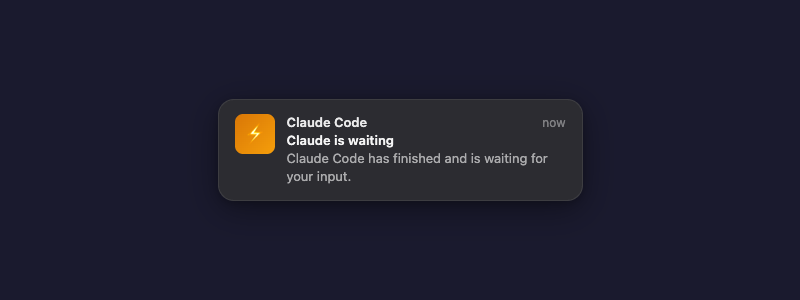
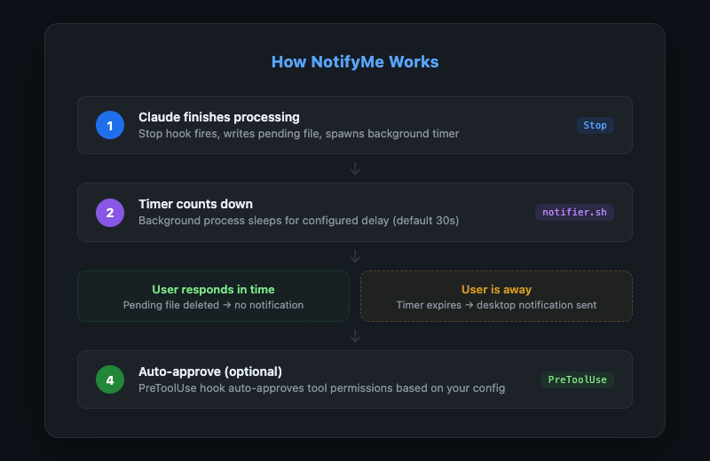
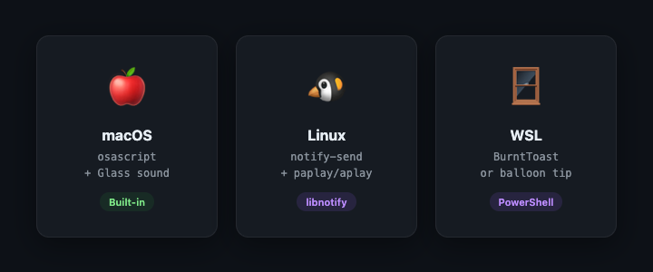
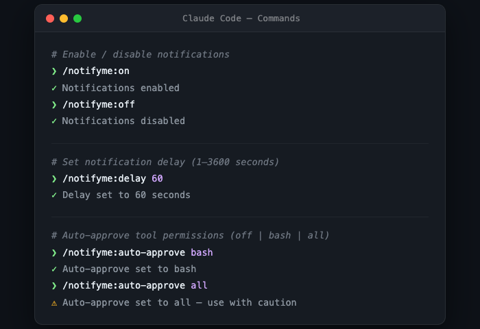
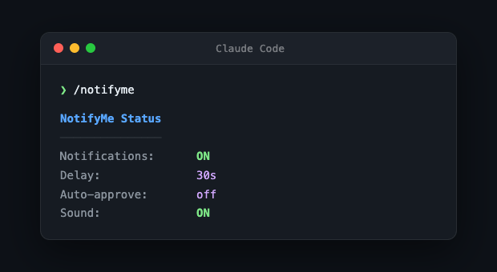

# NotifyMe — Claude Code Plugin

**Never miss when Claude is done.** Get desktop notifications when Claude Code finishes a task and is waiting for your input — plus configurable auto-approve to skip permission prompts. Clicking the notification brings your terminal/IDE back to focus.

[](LICENSE)
[](#platform-support)
[](https://claude.ai)
[](#testing)

---

## The Problem

You kick off a long task in Claude Code, switch to another window, and... forget about it. Minutes (or hours) later, you come back to find Claude has been patiently waiting for your input the whole time.

**NotifyMe fixes this.** It watches for when Claude stops and waits, then pings you with a desktop notification after a configurable delay — so you only get notified when you're actually away, not during active back-and-forth. Clicking the notification brings your terminal or IDE straight back to focus.

---

## Desktop Notification

When Claude finishes and you're away, you'll see a native desktop notification:

<p align="center">
  
</p>

---

## How It Works

NotifyMe uses three Claude Code hooks that coordinate through the filesystem:

<p align="center">
  
</p>

### Detailed Flow

1. **Claude finishes its turn** — `Stop` hook fires, detects the frontmost app (your terminal/IDE), writes a pending file to `/tmp/notifyme-<session>.pending`, and spawns `notifier.sh` in the background
2. **notifier.sh** sleeps for the configured delay (default: 30s)
3. **Meanwhile, if you respond** — `UserPromptSubmit` hook deletes the pending file, cancelling the notification
4. **After delay, notifier.sh wakes up:**
   - Pending file exists? — Send notification and bring your app to focus
   - Pending file gone? — You already responded, exit silently
5. **Race condition protection:** Each pending file contains a sequence number. Only the latest notifier can fire — older ones detect the mismatch and exit

### Auto-Approve Flow

When a tool is invoked (Bash, Edit, Write, etc.):

1. **PreToolUse hook** fires before the tool executes
2. Reads your `auto_approve` setting
3. Returns `allow` for matching tools, or defers to normal permission flow

---

## Platform Support

NotifyMe works across all major platforms with click-to-activate support:

<p align="center">
  
</p>

### macOS (Recommended)

Works out of the box with `osascript`. For **click-to-activate** (clicking the notification opens your terminal/IDE), install `terminal-notifier`:

```bash
brew install terminal-notifier
```

Without it, NotifyMe will auto-focus your terminal when the notification fires.

**Notification Center:** Go to System Settings → Notifications → Terminal (or your terminal app) → ensure notifications are allowed.

### Linux

Uses `notify-send` from libnotify for visual notifications and `paplay`/`aplay` for sound. Supports click-to-activate via `wmctrl` or `xdotool`.

```bash
# Debian/Ubuntu
sudo apt install libnotify-bin

# Fedora
sudo dnf install libnotify

# Arch
sudo pacman -S libnotify
```

### Windows (WSL)

Uses PowerShell's `BurntToast` module for rich notifications, with a balloon tooltip fallback.

```powershell
# Optional — for rich notifications
Install-Module -Name BurntToast -Force
```

---

## Installation

### From GitHub

```bash
# In your Claude Code settings, add this plugin:
# Settings > Plugins > Add from GitHub
# Repository: younann/notifyme-claude
```

### Manual Installation

```bash
git clone https://github.com/younann/notifyme-claude.git ~/.claude/plugins/notifyme
```

Then enable it in Claude Code settings:
```json
{
  "enabledPlugins": {
    "notifyme": true
  }
}
```

---

## Commands

All configuration is done through slash commands inside Claude Code:

<p align="center">
  
</p>

### `/notifyme` — View Status

Shows your current configuration at a glance.

<p align="center">
  
</p>

### `/notifyme:on` / `/notifyme:off` — Toggle Notifications

```
> /notifyme:on
Notifications enabled.

> /notifyme:off
Notifications disabled.
```

### `/notifyme:delay <seconds>` — Set Delay

Set how long Claude waits before notifying you (1–3600 seconds).

```
> /notifyme:delay 60
Notification delay set to 60s.
```

### `/notifyme:auto-approve <mode>` — Set Auto-Approve

| Mode | What Gets Auto-Approved |
|------|------------------------|
| `off` | Nothing — normal permission flow (default) |
| `bash` | Only Bash/shell commands |
| `all` | Everything — Bash, file edits, writes, etc. |

```
> /notifyme:auto-approve bash
Auto-approve set to bash.

> /notifyme:auto-approve all
⚠️ Auto-approve set to all — use with caution.
```

---

## Configuration

All settings persist across sessions in `~/.claude/notifyme.json`:

```json
{
  "notifications_enabled": true,
  "delay_seconds": 30,
  "auto_approve": "off",
  "sound": true
}
```

| Setting | Type | Default | Description |
|---------|------|---------|-------------|
| `notifications_enabled` | boolean | `true` | Master switch for notifications |
| `delay_seconds` | integer | `30` | Seconds to wait before notifying (1–3600) |
| `auto_approve` | string | `"off"` | Auto-approve mode: `off`, `bash`, or `all` |
| `sound` | boolean | `true` | Play sound with notification |

You can edit this file directly — changes take effect on the next hook invocation (no restart needed).

---

## Examples

### Scenario 1: Long-Running Task

```
You: "Refactor the entire auth module to use JWT tokens"
Claude: [works for 5 minutes...]
Claude: [stops, waiting for input]
         ↓
  [30 seconds pass, you're in another app]
         ↓
  🔔 Desktop notification: "Claude is waiting"
  → Click notification → Terminal comes to focus
```

### Scenario 2: Active Conversation

```
You: "What does this function do?"
Claude: "This function handles..."
         ↓
  [Timer starts, but you're already typing]
         ↓
You: "Can you add error handling?"
         ↓
  [Timer cancelled — no notification]
```

### Scenario 3: Auto-Approve Bash

```
You: /notifyme:auto-approve bash
     "Run the test suite and fix any failures"
         ↓
Claude: [runs pytest — auto-approved ✓]
Claude: [edits test file — prompts for permission as usual]
Claude: [runs pytest again — auto-approved ✓]
```

---

## Testing

NotifyMe includes a comprehensive test suite with **65 tests** covering all components:

```bash
python3 -m pytest tests/ -v
```

| Test File | Tests | Coverage |
|-----------|-------|----------|
| `test_config.py` | 13 | Config load/save, defaults, merge, atomic writes, error handling |
| `test_stop.py` | 14 | Stop hook, pending file creation, notifier spawning, app detection |
| `test_pretooluse.py` | 10 | Auto-approve modes, case sensitivity, response structure |
| `test_userpromptsubmit.py` | 6 | Pending file deletion, integration with stop hook |
| `test_notifier.py` | 13 | Shell script, delay, seq matching, cancel, click-to-activate |
| `test_hooks_json.py` | 6 | Hook registration structure validation |

---

## Project Structure

```
notifyme/
├── .claude-plugin/
│   └── plugin.json              # Plugin metadata
├── hooks/
│   ├── hooks.json               # Hook registrations
│   ├── stop.py                  # Stop hook — detects app, spawns delayed notifier
│   ├── pretooluse.py            # PreToolUse hook — auto-approve logic
│   ├── userpromptsubmit.py      # UserPromptSubmit hook — cancel notifications
│   └── notifier.sh              # Background notification + click-to-activate
├── core/
│   ├── __init__.py
│   └── config.py                # Config load/save with atomic writes
├── commands/
│   ├── notifyme.md              # /notifyme — show status
│   ├── on.md                    # /notifyme:on
│   ├── off.md                   # /notifyme:off
│   ├── delay.md                 # /notifyme:delay <seconds>
│   └── auto-approve.md          # /notifyme:auto-approve <mode>
├── tests/                       # 65 tests covering all components
├── assets/                      # Screenshots and mockups
├── README.md
└── LICENSE
```

---

## Troubleshooting

### Notifications not appearing?

1. **Check if enabled:** Run `/notifyme` to see status
2. **macOS:** System Settings → Notifications → your terminal app → ensure allowed
3. **Linux:** Verify `notify-send` is installed: `which notify-send`
4. **WSL:** Verify `powershell.exe` is accessible from WSL

### Notification doesn't focus my app?

1. **macOS:** Install `terminal-notifier` (`brew install terminal-notifier`) for click-to-activate
2. **Linux:** Install `wmctrl` or `xdotool` for window activation
3. Without these tools, the fallback will still send the notification but may not switch windows

### Auto-approve not working?

1. Run `/notifyme` to check the current mode
2. `bash` mode only approves Bash commands — file edits still require permission

---

## Contributing

Contributions are welcome! Feel free to:

- Report bugs or request features via [Issues](https://github.com/younann/notifyme-claude/issues)
- Submit pull requests for improvements
- Add support for additional notification backends

---

## License

[MIT](LICENSE) — Younan Nwesre
